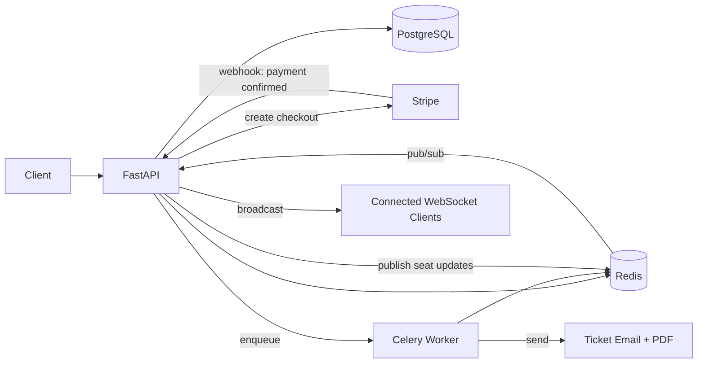

# TicketVault

A concurrency-safe event ticketing and booking backend — built to explore how real
booking systems (think Ticketmaster/BookMyShow) handle simultaneous seat reservations
correctly under load, from account auth all the way through to a paid, emailed ticket.


**Live demo:** https://ticketvault.onrender.com/docs *(may take ~30s to wake up on first request — free tier)*

---

## The problem this project solves

Naive booking logic has a race condition: two users can both read a seat as "available" before either write commits, resulting in the same seat being booked twice. This project demonstrates the full lifecycle of that problem — **reproducing it with a concurrency test, fixing it with PostgreSQL row-level locking, and verifying that exactly 1 of N simultaneous attempts can successfully book the same seat.**


Beyond that core problem, the project covers the rest of what a production
booking system actually needs: real-time seat map updates, temporary seat holds,
Stripe payments with idempotent webhook handling, async email/PDF delivery,
full-text search, rate limiting, and a tested, containerized, CI-checked deployment.

---

## Architecture



**Request flow for a booking:**
`hold seat (Redis TTL)` → `live seat map update (WebSocket via Redis pub/sub)` →
`Stripe Checkout` → `webhook confirms payment` → `booking finalized (row-locked)` →
`Celery: PDF + email sent async`

---

## Key Technical Decisions

- **Row-level locking (``SELECT FOR UPDATE``) for seat booking** — chosen over optimistic locking because seat contention is high and predictable, with popular seats potentially receiving simultaneous booking attempts. Verified with a custom concurrency test that allows exactly 1 successful booking when multiple requests target the same seat concurrently.

- **Optimistic locking (version column) for event edits** — organizers are unlikely to edit the same event simultaneously, so blocking requests would add unnecessary overhead; version-checked updates with a 409 Conflict response provide a better fit.
- Redis TTL for seat holds instead of a database timestamp — held seats expire automatically without polling or a dedicated cleanup job, while Redis keyspace notifications trigger the revert-to-available flow.
- **Redis pub/sub for WebSocket broadcasting** — keeps real-time seat updates independent of a single API process, allowing the architecture to scale across multiple API instances.
- **Idempotency at two layers** — application-level idempotency prevents duplicate booking operations, while Stripe's native idempotency support protects payment requests from being processed more than once during retries.
- **Service layer separation** — business logic lives outside route handlers, allowing booking and seat-hold operations to be reused across HTTP routes, background tasks, and tests without duplicating logic.
- **PostgreSQL full-text search instead of a dedicated search engine** — provides sufficient search capability at the project's current scale while avoiding the additional operational complexity of running Elasticsearch or another dedicated search system.

---

## Tech stack

FastAPI · PostgreSQL · SQLAlchemy · Alembic · Redis · Celery · Stripe · WebSockets
· Docker & Docker Compose · pytest · GitHub Actions · Render

---

## Running locally

### With Docker Compose (recommended)

```bash
git clone https://github.com/devvrat015/ticketvault.git
cd ticketvault
cp .env.docker.example .env.docker   # fill in your own values
docker-compose up --build
docker-compose exec api alembic upgrade head
```

Visit **http://localhost:8000/docs** for interactive API docs.

### Without Docker

```bash
python -m venv venv
source venv/bin/activate
pip install -r requirements.txt

# requires local PostgreSQL + Redis running
cp .env.example .env   # fill in your own values
alembic upgrade head
uvicorn app.main:app --reload
```

You'll also need a Celery worker running in a separate terminal for
async email/PDF features:
```bash
celery -A app.celery_app worker --loglevel=info
```

And, for local Stripe webhook testing:
```bash
stripe listen --forward-to localhost:8000/webhooks/stripe
```

---

## Running tests

```bash
pytest -v --cov=app
```

Includes automated tests for the booking flow, plus a dedicated concurrency test that reproduces and verifies the seat-booking race-condition fix.

---

## API documentation

Full interactive Swagger docs are auto-generated by FastAPI and available at
`/docs` (or `/redoc`) once the app is running.

---

## Deployment

Deployed on **Render** using its native Docker + multi-service (Postgres, Redis,
background worker) support.

**Services:**
| Service | Type | Purpose |
|---|---|---|
| `ticketvault-api` | Web Service (Docker) | FastAPI app |
| `ticketvault-worker` | Background Worker (Docker) | Celery worker |
| `ticketvault-db` | Managed PostgreSQL | Primary database |
| `ticketvault-redis` | Managed Redis | Cache, pub/sub, task broker, rate limiting |

**Deploying your own copy:**
1. Fork/clone this repo and push it to your own GitHub
2. On Render: create a **PostgreSQL** instance and a **Redis** instance first,
   note their internal connection URLs
3. Create a **Web Service** pointing at your repo, Docker runtime, using the
   root `Dockerfile`; set environment variables (`DATABASE_URL`, `REDIS_URL`,
   `SECRET_KEY`, `STRIPE_SECRET_KEY`, `STRIPE_WEBHOOK_SECRET`, SMTP credentials)
   to point at the managed Postgres/Redis instances
4. Create a **Background Worker** service, same repo/image, with start command
   `celery -A app.celery_app worker --loglevel=info`, same environment variables
5. After the first deploy, run migrations once via Render's shell:
   `alembic upgrade head`
6. Update your Stripe webhook endpoint (in the Stripe dashboard) to point at
   your live `/webhooks/stripe` URL, and copy the new signing secret into
   Render's environment variables

CI (GitHub Actions) runs the full test suite on every push to main. Render automatically deploys new commits from the connected GitHub branch.

**Note on the free tier:** the web service spins down after periods of
inactivity and takes ~30-50s to wake up on the next request — expected
behavior for a portfolio deployment, not a bug.

---

## What I'd add with more time

- Cursor-based pagination for large result sets (offset pagination degrades at
  very large page depths)
- A proper secrets manager instead of `.env` files for production credentials
- Kafka (or similar) instead of Redis pub/sub if the real-time layer needed to
  scale well beyond this project's current needs
- Multi-seat booking in a single transaction (with deadlock handling, since
  locking multiple rows introduces that risk)
- A stored, indexed `tsvector` column for full-text search instead of computing
  it on the fly, if search volume grew significantly

---

## Project structure

```
app/
├── api/          # route handlers (HTTP layer only)
├── core/         # config, security, database, redis, logging
├── models/       # SQLAlchemy models
├── schemas/      # Pydantic request/response schemas
├── services/     # business logic, HTTP-agnostic
├── tasks/        # Celery background tasks
alembic/          # database migrations
tests/            # pytest suite
scripts/          # one-off tooling (seed data, concurrency test)
```
 